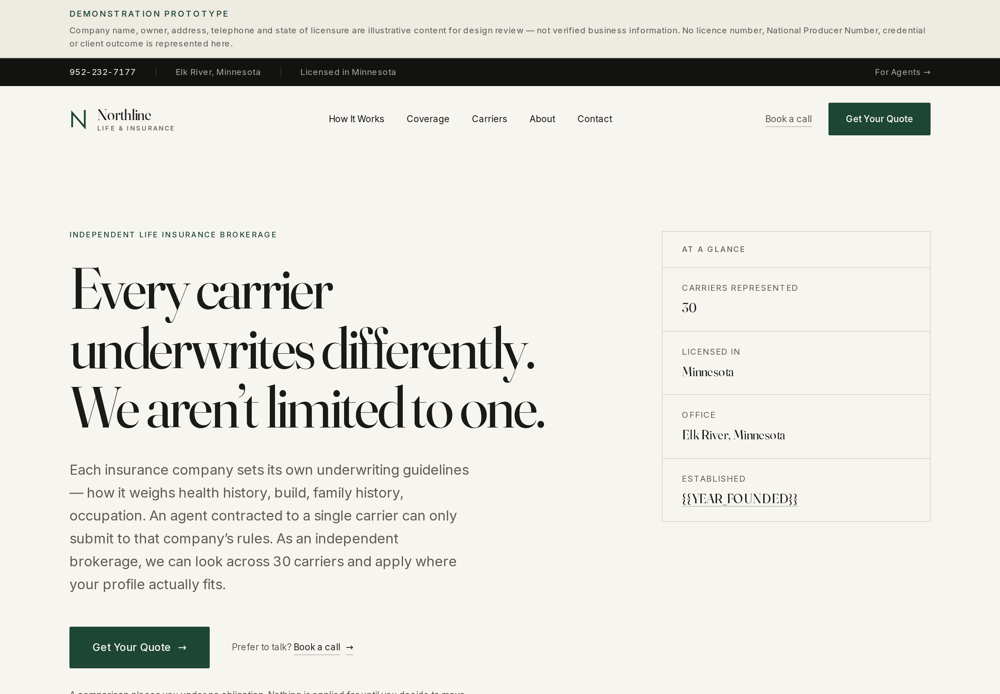
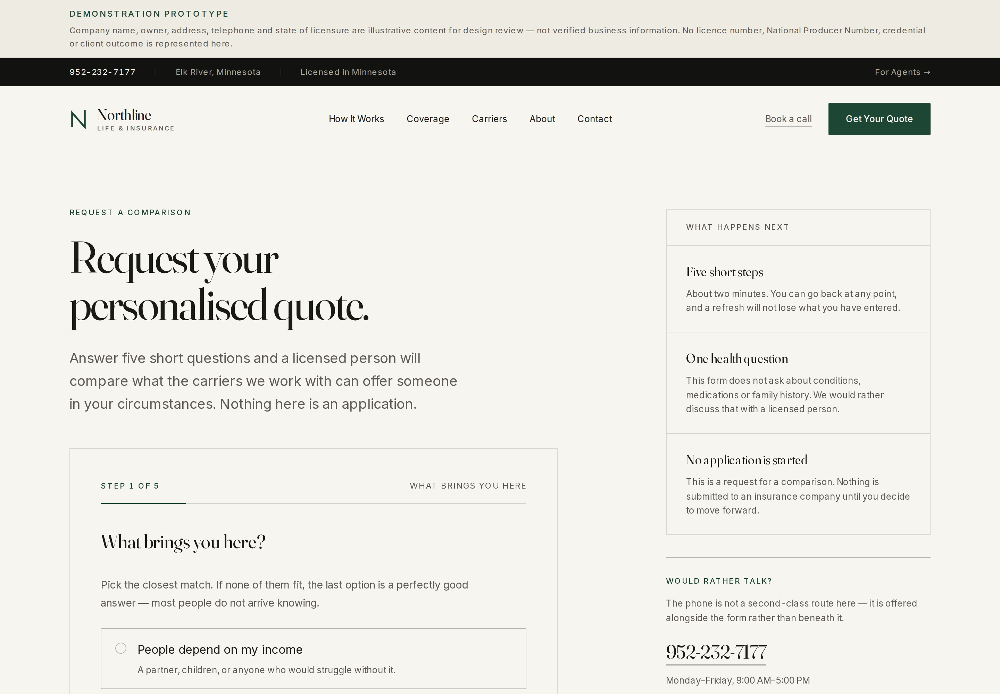
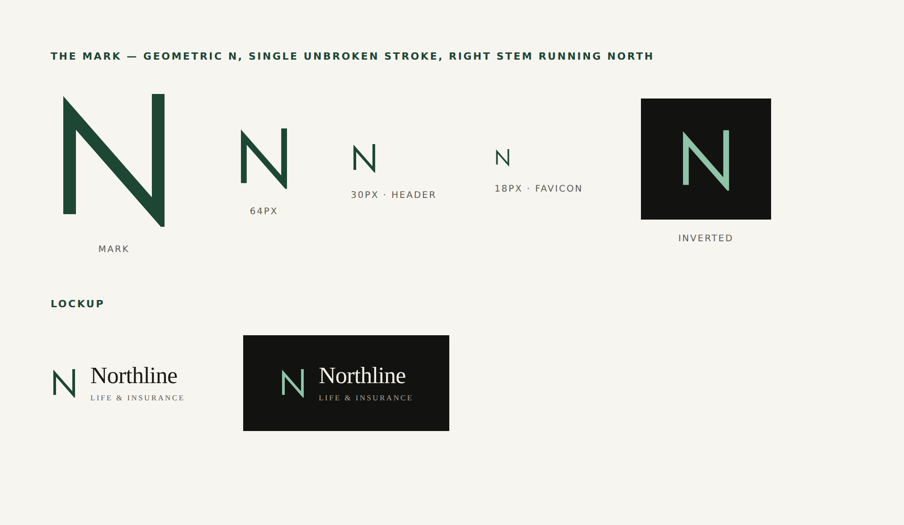

# Northline Life & Insurance

> ## ⚠️ This is a demonstration prototype, not a real business
>
> **Northline Life & Insurance does not exist.** The company name, owner,
> office address, telephone number and state of licensure in this repository are
> illustrative content created to demonstrate a website design.
>
> **No insurance licence number or National Producer Number appears anywhere in
> this repository**, and none should be added until they are real. See
> [NOTICE.md](NOTICE.md) for the full declaration.
>
> The running site announces this itself: a persistent notice sits above the
> header on every page, the footer labels its licensing block as demonstration
> content, all structured data is suppressed, and the whole site is `noindex`.

A website for an independent life insurance brokerage — the kind that holds
contracts with many carriers rather than one, and whose actual product is the
comparison between them.



---

## The idea

An independent brokerage's only real product is the comparison itself.

Every insurance carrier files its own underwriting guidelines. The same
applicant can land in a different rate class at different companies, because
each one decides for itself how to read a health history, a build, a family
history, a prescription record. An agent contracted to a single carrier can only
submit to that company's rulebook. An independent broker can look across many.

That argument is the entire site. Not "protecting what matters most" — the
mechanism, stated plainly, because the mechanism is both true and more
persuasive than sentiment.

---

## What makes this different from a template

**Nothing unverified can reach the page by accident.** Every business fact
renders through a `<Token>` component. Unfilled values appear visibly, with a
dotted underline, rather than silently defaulting to something plausible.
Sections whose facts are missing return `null` — enforced in the component
layer, not left to a content pass.

```tsx
// src/lib/site.config.ts — one file, 51 unfilled tokens
carrierCount: TOKEN("CARRIER_COUNT"),  // a carrier-appointment count is a claim
teamSize: TOKEN("TEAM_SIZE"),          // so is a count of licensed producers
npn: TOKEN("NPN"),                     // government-issued: never invented
compensationModel: TOKEN("COMPENSATION_MODEL"),
```

Every one of those is a token because none of them can be substantiated from
this repository. An earlier revision of this README printed
`carrierCount: "30",  // confirmed` — a fabricated figure, annotated as verified,
in the first file anyone reads. The count in the excerpt above is asserted by
`tests/regression/doc-consistency.mjs`, so the two cannot drift apart again.

**Pages degrade rather than break.** Carrier advertising rules commonly require
written permission before an agent may display a carrier's name, so `/carriers`
is built to work with *zero* publishable names — the argument carries the page
and logos are an upgrade. `/coverage` ships in an educational mode that explains
the market without claiming what the firm sells. It switches to a "what we
place" treatment only when someone sets `flags.productsConfirmed` — never
merely because the product list has entries, which is how demonstration data
could otherwise read as a verified offering.

**The quote form asks one health question.** Conditions, medications, height and
weight and family history are gathered by a licensed person on a call. It cuts
abandonment, avoids safeguarding duties for data the site cannot act on, and
those answers are not usable for a real quote without follow-up anyway.

**The lead route fails loudly.** In production, `/api/lead` returns `503` when
no delivery transport is configured and `502` when every configured transport
fails — never a false success. The visitor is then shown the office telephone
number instead of the enquiry vanishing into a log. In development, with
nothing configured, it answers `200` but labels the response
`"delivery":"simulated"`, so a stub can never be mistaken for a delivery.

**Consent is stored as evidence, not a boolean.** Every submission records the
exact TCPA consent wording the person agreed to, its version identifier, and a
server-stamped timestamp — because provability is the practical battleground,
not whether a box was ticked. The source URL is *derived* from the form kind
rather than read from a header, so it cannot be forged; the IP is recorded only
where the deployment can vouch for it, and everything the browser merely claimed
is filed separately under `unverified`.



---

## Design



**Institutional Editorial.** The register is a boutique wealth-management or law
firm rather than a consumer insurance brand — confident and restrained rather
than warm, because this is a competence purchase.

- **Type** — Fraunces for display with WONK and SOFT dialled to zero; Inter for
  body and UI, chosen partly because it ships real tabular figures. Both
  self-hosted, no runtime request.
- **Colour** — warm paper ground, warm near-black ink, dark bookends, and
  exactly one accent. Every pairing measured against WCAG AA; the weakest is
  5.69:1 against a required 4.5:1.
- **Layout** — real 12-column grid, asymmetric splits, hairline rules instead of
  drop shadows, 2px border-radius maximum.
- **Motion** — one gesture. A 14px rise and fade, 260ms, once. No parallax, no
  counters, no carousels.
- **The mark** — a geometric N drawn as one unbroken polyline, the right stem
  overshooting the cap line and running north. Uses `currentColor`, so one asset
  serves both grounds.

Explicitly avoided: gradient heroes, stock families in fields, "Trusted ·
Affordable · Fast" icon cards, and every other tell of the generated insurance
template. `/styleguide` documents the whole system.

---

## Running it

```bash
npm install
npm run dev          # http://localhost:3000
```

No environment variables are required **for development**. Production is
different — see [Lead delivery](#lead-delivery) below, which is the one place
where an unconfigured deployment deliberately refuses to work.

```bash
npm run build && npm start    # production build
```

---

## Lead delivery

The three forms post to `/api/lead`. What happens next depends on whether a
transport is configured, and the API never blurs the two.

| Environment | Transport configured | Response | What actually happened |
|---|---|---|---|
| development | no | `200 {"delivery":"simulated"}` | **Nothing was delivered.** The UI can be exercised end to end; the response says plainly that it was a stub. |
| development / production | yes, and it returned 2xx | `200 {"delivery":"delivered","transports":[…]}` | The lead reached the named transports. |
| production | no | `503` | Refused. Success is never reported for a lead nobody received. |
| production | yes, but every one failed | `502` | Refused, with the failure logged against the `requestId`. |

`"delivery":"simulated"` is only ever possible when `NODE_ENV` is not
`production`. A production deployment cannot return it.

### Configuring a transport

Two are implemented, both as plain HTTP calls with no SDK dependency. Set
either, or both — a lead is considered delivered if **any** configured
transport returns 2xx.

**Email — [Resend](https://resend.com):**

```
RESEND_API_KEY=re_xxxxxxxx
LEAD_FROM_EMAIL=leads@yourdomain.com     # a verified sending domain
LEAD_NOTIFY_EMAIL=you@yourdomain.com
AGENT_LEAD_NOTIFY_EMAIL=recruiting@…     # optional; producer applications only
```

**Store — any endpoint that accepts a JSON POST** (Airtable automation, a
Zapier or Make webhook, a Supabase edge function, a CRM intake URL):

```
LEAD_STORE_URL=https://…
LEAD_STORE_TOKEN=…                        # optional; sent as a Bearer token
```

Email alone is not enough for a real deployment. A consent record has to be
retrievable years later, and an inbox is not a record system.

### Verify your store endpoint once

A delivery counts as successful when the endpoint returns 2xx — that is the only
signal HTTP offers. An endpoint that answers `200` and quietly discards the body
is therefore indistinguishable from one that persists the record. After setting
`LEAD_STORE_URL`, submit one real test lead and confirm it actually arrived in
the destination. It is a thirty-second check that closes the one delivery
failure this code cannot detect for you.

### What is stored, and what is only claimed

The server does not trust the browser for anything that matters.

| Field | Where it comes from |
|---|---|
| `requestId`, `receivedAt` | generated server-side |
| `consent.version`, `consent.text` | the server's own constants, selected by the form kind |
| `consent.givenAt` | stamped server-side |
| `consent.sourceUrl` | **derived** from the form kind and `NEXT_PUBLIC_SITE_URL`. No request header contributes to it. `null` — with `sourceUrlReason` — when the build had no canonical URL, and in production such a submission is refused outright rather than recorded |
| `consent.ip` / `ipTrust` / `ipReason` | the forwarding header **only** when `TRUST_PROXY_HEADERS=1` *and* the value is a real IP address (validated with `net.isIP`, not a regex); otherwise `null`, with the trust level and the reason recorded in words |
| `consent.unverified.*` | what the browser claimed — the `Referer` (kept only when same-origin) and the user agent. Recorded for diagnostics, never as proof |

A mismatched consent claim is rejected with `409` rather than stored. Contact
messages carry no consent block at all, because that form asks for no marketing
permission.

### Deployment assumptions

Two settings describe the environment, and getting them wrong degrades safely
rather than silently.

**`TRUST_PROXY_HEADERS`** — set it to `1` only when every request arrives
through a proxy that overwrites `X-Forwarded-For` (Vercel, Cloudflare, an ALB,
a configured nginx). Then the client IP is recorded as consent evidence. Leave
it unset for a bare `next start` or a directly-exposed container: no IP is
stored, and the record says why.

Rate limiting does **not** depend on this setting. Every caller gets a counting
key regardless — a valid address, an unvouched-for one, a malformed one, or the
absence of any forwarding header. Making yourself unidentifiable is not a way to
become unlimited.

**`NEXT_PUBLIC_SITE_URL`** — read at **build** time, and effectively required
in production. A build made without it cannot establish where consent was given,
so consent-bearing submissions are refused with a `503` and the reason is logged
rather than a record claiming `http://localhost:3000/quote` being stored.
Contact messages, which carry no consent block, are unaffected.

#### Rate limiting

Two separate per-caller budgets in a 60-second window, so that cheap invalid
traffic can never consume the capacity reserved for real leads:

| Variable | Default | Charged by |
|---|---|---|
| `LEAD_RATE_LIMIT_PER_IDENTITY` | 5 | leads that are actually **delivered**. Charged at one point, immediately before delivery, once content type, size, JSON, schema, Turnstile, the honeypot, consent and the licence footprint have all passed — and **refunded** if delivery then fails |
| `LEAD_RATE_LIMIT_REJECTS` | 30 | every request that does not become a delivered lead: `415`, `413`, `400`, `422`, `403` (Turnstile), `409` (consent mismatch), honeypot hits, and `502`/`503` delivery failures |
| `LEAD_RATE_LIMIT_GLOBAL` | **0 — off** | valid submissions only, site-wide. Opt-in runaway guard |

The global ceiling is off by default on purpose. A site-wide counter that any
caller can exhaust is a denial-of-service lever against every other visitor;
sixty empty POSTs used to be enough to return `429` to the whole site.

This table is asserted against the code by `tests/regression/doc-consistency.mjs`
and exercised end to end by `tests/regression/budget-matrix.mjs`, which walks
every exit status the endpoint has and measures which budget moved. It said
something narrower and out of date until finding R6-08 — it listed only the
four cheap rejections, and described the submission charge as happening before
Turnstile and consent, which is what R4-04 changed.

A request that trips the honeypot is charged to the **rejection** budget, not
the submission budget. It answers `200` and delivers nothing, exactly as before,
but it is counted — previously it was the one request shape that reached JSON
parsing, full schema validation and the log with no counter at all, so the
traffic the honeypot exists to catch was the least constrained traffic on the
endpoint. The rejection budget rather than the submission budget for two
reasons: a forged forwarding header must not become a way to consume a specific
visitor's five real submissions, and a password manager that fills every field
must not cost a real person the enquiry they are still writing. One residual
difference is worth stating: the two ceilings differ (30 vs 5), so a client
probing both could in principle infer which field is the trap.

The honeypot is also distinguishable by **timing**, and that is not fixed. The
check runs after Turnstile so the verification round-trip lands on both paths,
but Turnstile is off by default, and with it off the gap is simply the delivery
the honeypot does not perform. Measured on this build, 250 interleaved samples
per arm: honeypot median 2.16 ms, real submission median 3.59 ms, a ratio of
1.66 — unchanged from the 1.62 measured before the ordering change, because
that change only does anything when Turnstile is configured. A single paired
sample classifies correctly about 90% of the time. This is accepted rather than
closed; see "Known limitations".

All counters live in the process memory of one instance — a speed bump, not a
distributed limiter. See "Known limitations" below.

### Security headers

Every response carries a Content-Security-Policy, `frame-ancestors 'none'` plus
`X-Frame-Options: DENY`, `X-Content-Type-Options`, `Referrer-Policy`,
`Permissions-Policy` and HSTS, and `X-Powered-By` is removed. The policy is
defined once in `next.config.mjs` with a comment explaining every allowance.
`tests/regression/security-headers.mjs` loads all 19 routes in a browser and
fails on any CSP violation, so a policy that breaks fonts, hydration, the forms
or Turnstile cannot pass unnoticed.

A `STATIC_EXPORT=1` build has no server, so Next cannot send these headers —
the static host has to. That build is a visual preview only and was never a
deployment target.

### Spam protection

Cloudflare Turnstile is optional and is a single switch, not two:
`NEXT_PUBLIC_TURNSTILE_SITE_KEY` and `TURNSTILE_SECRET_KEY` must both be set or
both be absent. **A production build fails if exactly one is present** — a
widget that protects nothing is worse than no widget. With Turnstile off, the
honeypot field and the per-caller rate limiter still apply.

Two properties of this layer are deliberate choices, and neither is a
production-grade guarantee:

**Turnstile fails open on the SERVER, and cannot on the CLIENT.** This is two
different behaviours and the distinction matters.

*Server side, it fails open.* A missing or invalid token is refused with a 403,
but if the verification endpoint cannot be reached at all — an outage, a network
partition, an 8-second timeout — the submission is allowed through and the event
is logged. A small brokerage's enquiry form should not go offline for the
duration of someone else's outage, and a lost life insurance enquiry costs more
than a spam message that still has to clear the honeypot and the rate limiter.
The honest consequence: **Turnstile here does not guarantee spam prevention
under every network condition.** To fail closed instead, return `false` in the
catch block in `src/app/api/lead/route.ts`.

*Browser side, it cannot fail open, and does not pretend to.* If the widget
script never loads — an ad-blocker, a privacy extension, a corporate filter, a
regional block — no token exists for the server to accept or reject, and a
client that simply asserted "the widget did not load, let me through" would hand
every bot the same sentence. Until Round 3 this failed silently: the visitor
filled the form in, pressed Send, and got "We could not send that just now.
Please try again" — advice that could never work. The form now detects that
state up front, says what has happened and why, and offers the office telephone,
which is a channel the business already staffs. It is a real fallback rather
than a hole.

**The rate limiter is in-memory and per-instance — not a distributed rate
limiter.** The counters are Maps in one process. Every instance keeps its own
and a cold start or redeploy resets them. It is kept as-is on purpose: it stops
casual repeat submissions and accidental double-posts without adding
infrastructure to a prototype. A deployment that actually needs abuse control
should swap it for a shared store (Upstash Redis, Cloudflare Durable Objects) or
the platform's WAF.

**Without a trusted proxy, a caller who rotates `X-Forwarded-For` gets a fresh
bucket each time.** This is stated rather than solved. Bounding it properly
needs state a prototype should not invent, and the two obvious shortcuts are
both worse than the problem: a shared bucket for unidentifiable callers lets one
visitor lock out everyone, and a global ceiling lets anyone deny the whole site.
Both were tried in this repository and both were removed as vulnerabilities.
What remains in front of it is the honeypot, Turnstile, and the body-size and
schema checks. A real deployment should set `TRUST_PROXY_HEADERS=1` behind a
proxy that overwrites the header — where rotation is impossible — or apply a
WAF rule at the edge.

**Delivery to a custom `LEAD_STORE_URL` is verified as far as HTTP allows, and
no further.** A non-2xx is a failure; a 2xx that returns HTML is treated as a
failure too, because a parked domain, captive portal or decommissioned webhook
answering 200 with a marketing page would otherwise be reported to the visitor
as a received enquiry. But an endpoint that answers 2xx with JSON or an empty
body and then silently discards the record is indistinguishable over HTTP from
one that stores it. **Delivery is therefore not guaranteed by the code alone** —
after configuring the store, submit one test lead and confirm it arrived.

**There is no server-side replay protection.** The forms guard against the
common case — a double-click or a triple-click sends exactly one record, and
`tests/form-flows.mjs` asserts it — but that is browser-side. An identical
payload POSTed three times with a script produces three stored records, bounded
only by the per-caller submission budget. Deduplicating properly needs a
durable, shared idempotency store, which is the same infrastructure the rate
limiter deliberately does without; adding it for a prototype would be inventing
a datastore to solve a problem the operator can see in their own inbox. Stated
here rather than left for someone to discover.

**A caller who can reach the origin directly can be counted as someone else.**
Without a trusted proxy the rate-limit key comes from `X-Forwarded-For`, which
the caller controls — so sending a victim's address consumes that victim's five
submissions for the minute. Measured: eight forged requests, then the real
visitor gets `429`. Bounded (a 60-second window, self-healing) and not
exploitable behind a proxy that overwrites the header on an origin that is not
otherwise reachable, which is the documented deployment. It is the same trust
assumption as header rotation, stated from the other direction, and it is not
fixable in the application: the application cannot tell a forged header from an
honest one, which is exactly what `TRUST_PROXY_HEADERS` exists to declare.

**The limiter sweeps its whole map on every request.** `sweep()` is O(n) in the
number of tracked callers, with no cap on map size. In practice this is
self-limiting: entries expire on a 60-second window faster than one Node process
can create them. Measured at 60,000 rotating identities — RSS 92 MB, control
request latency 4–10 ms, no degradation. Recorded because it is a real property
of the design, not because it is currently reachable.

**Prerendered HTML is served with `Cache-Control: s-maxage=31536000`.** That is
Next's default for statically prerendered routes and is revalidated by Next's
own mechanism, but a CDN in front of this site will hold pages for a year unless
the deployment purges on release.

**The 404 page serves two `<meta name="robots">` tags.** Next.js injects
`noindex` for any 404 response and this is not configurable; the root layout
adds `noindex, nofollow`. Both agree, and a crawler applies the most restrictive
union, so the effective directive is the intended one. Removing the layout's
directive to deduplicate would leave every *other* route without one, which is
a real problem traded for a cosmetic one.

### What is never logged

No lead PII reaches the application log — no name, email, telephone, free text
or health answer. Neither does any remote service's response body: a
custom `LEAD_STORE_URL` could echo the submitted lead back inside an error
response, so a failed delivery is reduced to five fields before it can reach a
log line — request id, transport, HTTP status, a fixed failure category, and a
fixed detail string this codebase constructs. The categories are `network`,
`timeout`, `auth`, `rate-limited`, `rejected`, `remote-error`, `not-a-store`
and `blocked-destination`; `tests/regression/doc-consistency.mjs` asserts that
this list is exactly the `FailureCategory` union in `src/lib/delivery.ts`, so
the two cannot drift apart.

### Routes

| | |
|---|---|
| `/` | Homepage — the independence argument |
| `/how-it-works` `/coverage` `/carriers` | The explanatory core |
| `/about` `/faq` `/contact` | Firm, objections, office |
| `/quote` | **Primary conversion** — five-step form |
| `/schedule` | Secondary conversion |
| `/careers` `/careers/apply` | Recruiting funnel, deliberately quarantined |
| `/privacy` `/terms` | Legal drafts, pending review |
| `/styleguide` | Design system reference |

Plus four thank-you routes (one per form, so conversions can be told apart), a
branded 404, `sitemap.xml` and `robots.txt`.

---

## Deploying

**A GitHub repository link shows the code, not a running website.** To get a URL
someone can actually click, deploy it. The API route needs a server, so a static
host will not run the forms.

**Vercel** — free, built for Next.js, redeploys on every push:

1. [vercel.com/new](https://vercel.com/new) → import this repository
2. Framework preset: Next.js (detected automatically)
3. Add `NEXT_PUBLIC_SITE_URL` with the deployed URL — canonical URLs, Open Graph
   URLs, the sitemap and the consent-evidence source URL are all built from it,
   and it is read at build time
4. Add `TRUST_PROXY_HEADERS=1` — Vercel overwrites the forwarding headers, so
   the client IP is trustworthy there
5. Add at least one lead transport (see [Lead delivery](#lead-delivery)), or
   the forms will return `503`
6. Deploy

Leave `NEXT_PUBLIC_ALLOW_INDEXING` unset. The site should stay out of search
results while it carries demonstration content.

---

## Before this becomes a real website

[COMMITMENTS.md](COMMITMENTS.md) records which service promises the business has
signed off on, and why the struck ones were removed. Read it before changing
copy.

Then, in order:

1. Fill the launch-critical values in `src/lib/site.config.ts` — legal entity
   name, office details, **real licence number and NPN**, states of licensure,
   exact carrier count.
2. Replace the two photography plates on the homepage and `/about` with real
   photographs. This does more for perceived legitimacy than any design
   decision available.
3. Configure a mail transport and a persisted store — see
   [Lead delivery](#lead-delivery). Both are implemented; production refuses
   submissions until at least one is set.
4. Have `/privacy` and `/terms` reviewed by counsel or the E&O carrier.
5. Set `flags.demo = false` — only once all of the above is true.
6. Lift `noindex` last.

---

## Stack

Next.js 16 (App Router) · React 19 · TypeScript (strict) · Tailwind CSS · Zod
(shared client/server validation) · self-hosted Fraunces + Inter via
`next/font`.

Audited across 19 pages × 5 viewports for responsive behaviour, accessibility,
SEO metadata, structured data, CTA consistency, token usage, broken links,
console errors, 404 behaviour and the mobile experience.

## Licence

See [LICENSE](LICENSE) — all rights reserved by default. The brand is
demonstration content; see [NOTICE.md](NOTICE.md).
